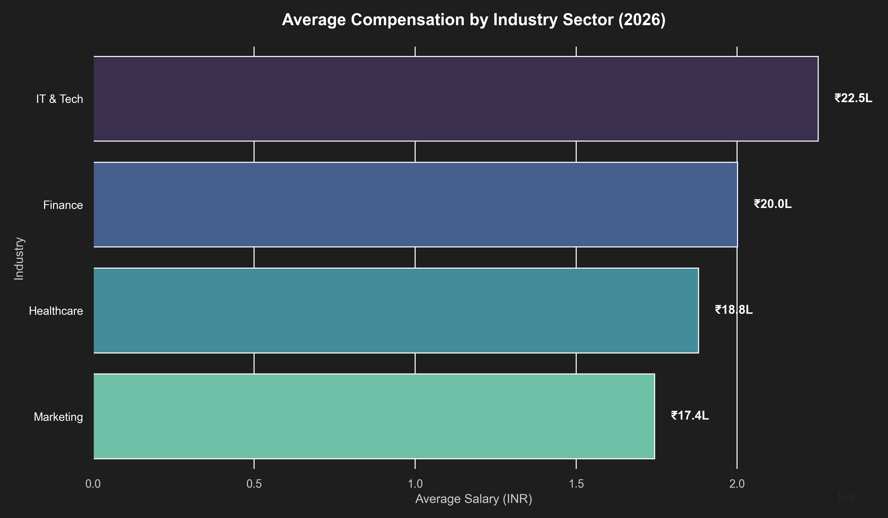
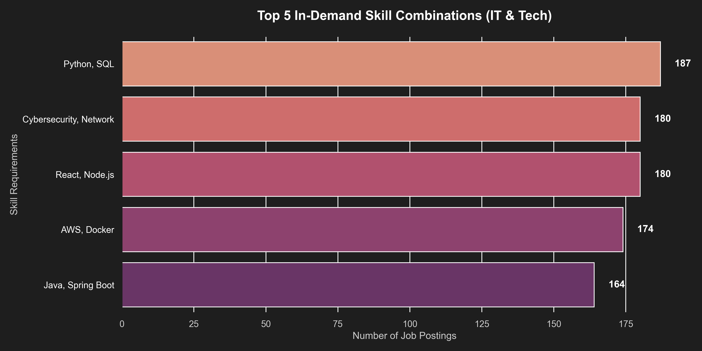
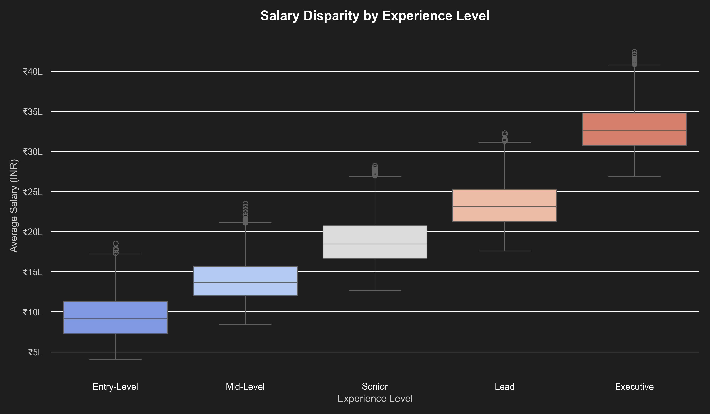
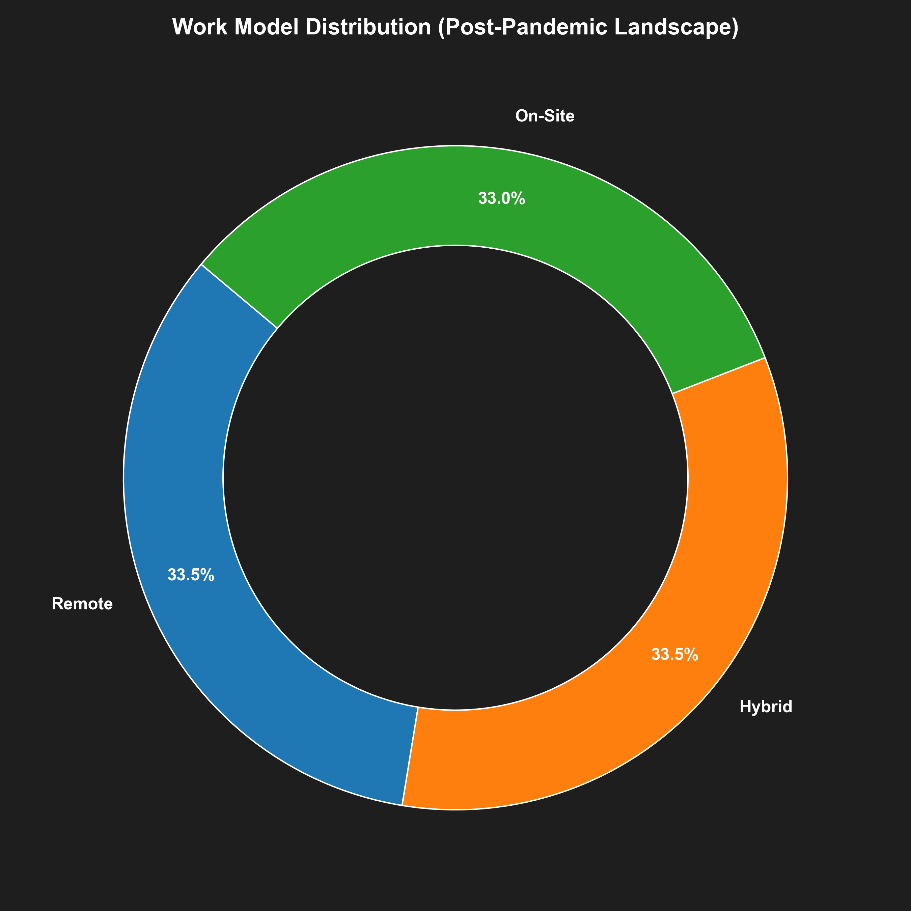

# 💼 Job Market & Skill Demand Analysis 2026

## 📌 Project Overview
This project analyzes the current job market trends, salary distributions, and most in-demand skills across various industries (IT, Finance, Marketing, Healthcare). The analysis provides actionable insights for freshers and professionals aiming to upskill based on actual market demands in 2026.

## 🎯 Key Objectives
* Understand which industries offer the highest median salaries.
* Analyze the shift between Remote, Hybrid, and On-Site work models.
* Identify the most required technical and soft skills for top-paying roles (e.g., Python, SQL, Cloud).
* Perform demographic analysis across major tech hubs like Bengaluru, Pune, and Hyderabad.

## 🛠️ Tech Stack & Methodology
* **Data Manipulation & Analysis:** Python (Pandas, Numpy)
* **Data Visualization:** Matplotlib, Seaborn
* **Database Querying:** Advanced SQL (Aggregations, Grouping, Filtering)

---

## 📈 Key Data Visualizations

### Industry Compensation Breakdown

  

### Market Demand by Tech Skills

  

### Salary Growth by Experience Level

  

### Remote vs Hybrid Work Distribution

  

---

## 📂 Repository Contents
* `Job_Market_Skill_Demand_2026.csv`: Raw dataset containing 5,000+ job listings.
* `job_analysis.py`: Python script for Exploratory Data Analysis (EDA) and professional chart generation.
* `queries.sql`: SQL queries used to extract specific business insights from the dataset.
* Visualizations (`.png`): Exported high-quality charts showcasing work-type distribution and industry salaries.

## 👨‍💻 Developer
**Swapnil Gaikwad**  
*BCA (Sci.) Student at Deogiri College, Chhatrapati Sambhajinagar*

*Connect with me on LinkedIn to discuss data analysis, Python, and SQL!*
